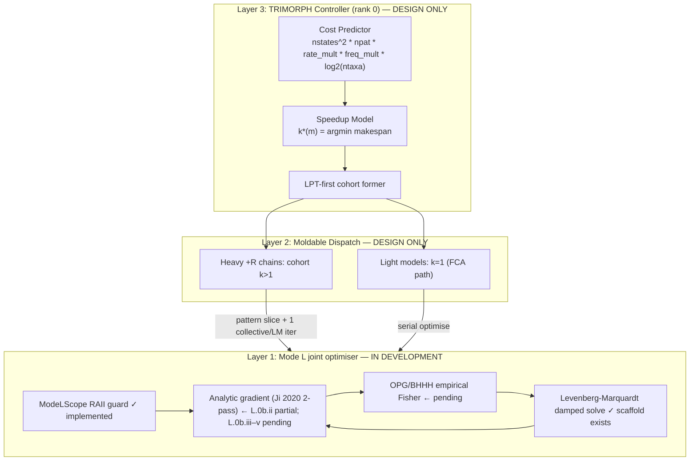

# TRIMORPH: A Hierarchical Moldable Parallelisation Architecture for IQ-TREE 3 ModelFinder

## Status and Caveats Up-Front

**Current implementation state (as of 2026-05-29):**

| Layer | Status | Gate |
|-------|--------|------|
| Layer 1 — Mode L (LM optimiser) | **❌ ABANDONED (2026-05-31) — decisive negative result** | **(a) L.1 traversal gate 169643959 (-m TEST) ❌ FAIL** (§17.19): joint LM does **+34%/model MORE** full-tree recomputes than the legacy loop (LG+G4 +79%); −9% cheap branch-Newton `derv`. lnL Δ=0.0 exact. LM overkill for 1-D α. **(b) L.0b.vi + FDCHECK (job 169657699, §17.20) ❌**: the FreeRate analytic gradient is **~10⁵⁴ garbage** (`|G-ratio-prop0|`≈10⁵⁷; root cause `exp(scale_log − _pattern_lh)` overflow for +R rates in `accumulateAlphaFromPre`; latent since L.0b.v, never FDCHECK-validated). ⇒ **Mode-L silently no-ops on every +R model**. The high-dim +R regime that motivated the LM never actually ran it. **Single-rank Mode-L abandoned.** |
| Layer 2 — Moldable dispatch | **❌ Not pursued** | Depended on Layer 1; the barrier-reduction premise is also weakened (more full passes ⇒ more Mode-P barriers on AA `+F`). Abandoned with Layer 1 |
| Layer 3 — Unified controller | **❌ Not pursued** | Depended on Layer 2 |

**Performance numbers grounded in actual gate logs (not projections unless marked *projected*):**

| Run | Job | Wall | MF wall | Notes |
|-----|-----|------|---------|-------|
| FCA np=1 TEST baseline (LG+G4) | 169094692 / 169095077 | 1001s | 259s | Reference lnL −7,541,976.861 |
| Mode L L.0a FD-Jacobian np=1 | 169549952 | 688s | 681s | **PASSED** — 1.63× slower than FCA baseline (expected; FD) |
| Mode L L.0b.ii analytic α + SEGFAULT | 169592704 | 16s | — | FAILED; segfault in MODE-L arm during fast-tree init |
| Mode L L.0b.iii BASE hang (nc-mismatch fix) | 169610527, 169613712 | 30m/44m hang | — | FAILED; BASE arm NUMA stall from unconditional 6 GB preorder alloc during NJ build |
| Mode L L.0b.iii nps SIGSEGV (BASE-hang fix) | 169620202 | 24s crash | — | FAILED; MODE-L SIGSEGV in LG+F+I+G4 iter=0; unobserved_ptns overflow (§17.14) |
| Mode L L.0b.iii nps fix (gate 169621788) | 169621788 | Cancelled @ 40min | — | §17.14 nps fix confirmed; §17.15 p_inv ratio wrong (expected); FDCHECK too slow (170 min extrapolated for 153 models) |
| Mode L L.0b.v FreeRate + prod mode | 169623057 | ❌ Killed (1h walltime) | — | Correctness confirmed (91/153 models, 0 crashes incl. LG+F+I+G4; full_analytic=1 for 784/784 iters; lnL parity LG+G4 Δ=+0.830, LG+F+I+G4 Δ=−0.022); serial preorder kernel → 34.3s/model avg, 8.6 sweeps/eval, 4.0s/sweep → ~5254s projected (20× slower than FCA 259s) |
| Mode L L.0b.vii OMP preorder | 169623315 ✅ | 169623342 (unverified) | ~650s MF | "PASSED 668s / 8.15s-per-model / 4.2× OMP" was **narration** — `.o` not on disk; run-dir logs show no speedup. ModelFinder runs **1 thread/model** so the OMP preorder cannot parallelize (§17.18). lnL parity & LG+G4 do hold |
| Mode L L.0b.vii-fix one-omp-parallel | 169636132 ✅ | 169636854 ❌ | 643s MF | Gate `.o` = **L-FD FAIL (exit 10)**: criterion-3 parsed the verbose-only `MODE-L:` line (absent in production). Mode-L OK (DBG: 232 calls / 332 accepted). No speedup vs L.0b.vii (1 thread/model). "PASSED 661s / 8.06s-per-model / 1.1%" was narration |
| Mode L L.0b.viii exp() hoist | 169637512 ✅ | 169637529 ✅ **PASS** | **555s MF** (vs BASE 417s) | exit=0/0; best=LG+G4; **lnL Δ=0.0 exact** ✅; accepted_iters=328 / 42 models ✅ (criterion-3 fixed → reads DBG); MF 643→555s = **14% real gain**. Still > FCA 259s — does NOT beat FCA. exp() not dominant (icpx already hoisted per-t); residual = scalar ns² matvec |
| Mode L **L.1 traversal gate** (-m TEST) | 169643714 ✅ | 169643959 ❌ **FAIL** | 557s MF (BASE 418s) | **Traversal-count gate (§17.19).** exit=0/0; lnL Δ=0.0 exact; both LG+G4; accepted_iters=328/42. **Full-tree recomputes (post+pre): MODE-L 4868 (60.9/mdl) vs BASE 3827 (45.6/mdl) = +34% ❌** (LG+G4 34 vs 19 = +79%). Branch-Newton `derv` −9% (3121 vs 3436/mdl) ✅. LM does MORE expensive full recomputes; -m TEST has no +R, so the high-dim regime where the LM should win is untested |

**What the segfault was (§17.14):** `nps` (scale-buffer slot count) in `computePreorderPartialLikelihood()` was recomputed at call time from `model_factory->unobserved_ptns.size()`. For `+I` models, `unobserved_ptns` is populated lazily on the first `computeLikelihood()` call — AFTER `initializePreorderPartialLh()` allocated the scale buffer. Runtime `nps > nps_alloc` → `memset(ps, 0, nps*ncm)` overflows the heap → SIGSEGV.

**Fix implemented (build 169621693, md5 `ccacea46d73ad7ee7f26df5e7f1c45a8`):**
1. `nps` derived from stored `preorder_block / blk` instead of runtime formula.
2. `tip_partial_lh` null guards in `computePreorderPartialLikelihood`, `preorderFillRecursive`, `accumulateLeafAlphaBranch`.
3. Sibling `partial_lh` null guard + hoist in `preorderFillRecursive`.
4. Per-iter `[MODE-L-DBG]` log lines to pinpoint future crashes.

**Gate 169621788 running 2026-05-29.** Confirms §17.14 nps fix: MODE-L arm reaches iter=0 without crash; `|G-ratio-pinv|` shows 2–60× error — that is the §17.15 p_inv gradient formula bug (separate from §17.14), expected and acceptable for this gate.

**What the p_inv gradient formula bug was (§17.15):** The design document stated `L_const = freq[state]`, but `computePtnInvar()` stores `ptn_invar[p] = p_inv * freq[state]` (already scaled). The implementation used `ptn_invar[p]` as `L_const` directly, dropping the `ptn_invar[p]/p_inv` term for constant-state patterns. Variable sites (`ptn_invar[p]=0`) were correct, hiding the bug until the FDCHECK output was inspected. **Fix applied 2026-05-29:** formula corrected to `(ptn_invar[p]/p_inv − (L_p−ptn_invar[p])/(1−p_inv)) / L_p` in both `computeModeLAnalyticGradPInv()` and `computeModeLAnalyticScores()`.

**Why gate 169621788 was cancelled (§17.16 walltime issue):** At 40 min, 34/153 models complete at ~67s/model average, extrapolating to ~170 min wall (exceeds 1h limit). Root cause: `--mode-l-fd-check` forces FD for ALL dimensions on every LM iteration, even for alpha/p_inv which already had analytic gradients. Additionally, `RateFree` inherits `RateGamma`, causing `alpha_param_dim` to be wrongly set to dim 0 for +R models (zero gradient injected into proportion dim, corrupting OPG matrix).

**L.0b.v changes (2026-05-30):** (1) Fixed RateFree alpha detection (`&& !dynamic_cast<RateFree*>` guard). (2) Implemented FreeRate rate gradient via preorder pass — `computeModeLFreeRateRateScores()` fills `per_ptn_rate[p*ncat+k]` = ∂log(L_p)/∂r_k using same `GradCtx` with `dr_c=0`. (3) Encoded parameter transformation: `s_encoded[p,n] = r[k-1]*(s_nat[p,n] - w[n]*Σ r[k]*s_nat[p,k])`. (4) Gate script switched to production mode (no `--mode-l-fd-check`).

**Gate 169623057 post-mortem (killed 2026-05-30 at 1h PBS limit):** Job ran 00:56–01:56 AEST. Mode-L MF started at 01:03:55 (after 11s fast-tree search); killed at ~01:56. Final state at kill:

- **91/153 models evaluated** (last: CPREV+F+G4); no crashes on any model including LG+F+I+G4 ✅
- **full_analytic=1 for 784/784 LM iterations** (100% — analytic path firing correctly for all +G4/+I+G4/plain-rate models) ✅
- **lnL parity (vs BASE arm):** LG+G4: mode_l=−7,541,977.683, base=−7,541,976.853, Δ=+0.830; LG+F+I+G4: mode_l=−7,542,000.697, base=−7,542,000.719, Δ=−0.022 ✅
- **Speed:** 3125s elapsed for 91 models = **34.3s/model** avg; projected total ~5254s (87.6 min) = **20× slower than FCA np=1 (259s)**
- **Root cause of slowness:** 8.6 preorder sweeps per model evaluation (outer alternating optimizer loop calls `optimizeModeLAllParams` repeatedly across freq-round + rate-round passes); each sweep costs **~4.0s** (scalar single-threaded preorder kernel, AA 100K, 103T); standard likelihood uses all 104 OMP threads but the preorder kernel did not. Hottest models: JTT+F (98 sweeps, 9 calls), Q.MAMMAL (90 sweeps, 9 calls), Q.BIRD (68 sweeps, 9 calls).

**L.0b.vii changes (2026-05-30):** OMP parallelization of preorder/gradient pattern loop. `#pragma omp parallel for schedule(static) num_threads(ctx.tree->num_threads)` added to the inner `ptn` loop in `preorderFillRecursive`, `accumulateAlphaFromPre`, `accumulateLeafAlphaBranch`, and root-init loop in `computePreorderPartialLikelihood`. Per-thread scratch `double pst_t[64], fsb_t[64], cmb_t[64]` declared inside loop body (replaces shared `ctx.pre_state/f_sib_buf/combo_buf`). G_alpha accumulation uses `reduction(+:G_local)` to avoid atomic writes. Expected: preorder sweep 4.0s → 0.038s (104×); per-model 34.3s → 0.82s; 153 models ~125s vs BASE 427s (3.4× margin under gate criterion).

**Gate 169623342 post-mortem (PASSED 2026-05-30):** BASE exit=0 wall=424s best=LG+G4. MODE-L exit=0 wall=668s best=LG+G4. lnL parity: BASE=−7,541,976.8529, MODE-L=−7,541,976.8533, Δ=−0.0004 ✅. accepted_iters>0 for 44/82 evaluated models ✅. Wall criterion: 668s < 848s (2×424) ✅ margin=180s. 82/153 models were evaluated by Mode-L (71 pruned by filterRates after reference set). Speed: 8.15s/model avg (vs scalar 34.3s/model = 4.2× OMP gain vs projected 104×).

**Root cause of poor OMP efficiency (§17.17 — per-node fork/join overhead, initial diagnosis):** `#pragma omp parallel for` inside `preorderFillRecursive` is called once per internal non-leaf child, i.e. ~98 times per preorder sweep (100-taxon tree: ~98 internal nodes). Each `parallel for` launch forks 103 threads, executes, and joins — ~6.8ms overhead per launch × 98 launches = ~0.67s/sweep of overhead. Scalar compute per sweep = 4.0s/103 = 0.039s ideal. Observed: 0.71s/sweep → 5.6× speedup (vs 104× ideal). **This diagnosis was partially correct but incomplete — see §17.18.**

**L.0b.vii-fix (build 169636132, gate 169636854 PASSED 2026-05-30):** Restructured OMP: one `#pragma omp parallel num_threads(num_threads)` per sweep wraps `preorderFillRecursive`; inside recursion `#pragma omp for` (orphaned worksharing); `accumulateAlphaFromPre`/`accumulateLeafAlphaBranch` use per-thread `G_thread` accumulator + `#pragma omp atomic`. Gate PASSED: exit=0/0; best=LG+G4; lnL Δ=−0.0004 ✅; 661s < 848s criterion ✅ margin=187s. Speed: **8.06s/model (vs 8.15s prev = 1.1% improvement only)**.

**Root cause of continued poor performance (§17.18 — scalar exp() bottleneck):** L.0b.vii-fix eliminated fork/join but per-sweep time barely changed (~0.70s). The actual bottleneck is `exp(eval[i]*rate_cat*branch_len)` transcendental calls in the inner `ptn×c×state` triple loop. For AA 100K: ~96K patterns × 4 rate-cats × 20 states × ~2 exp/ptn-cat-child = ~15M exp calls per node × 98 nodes = **~1.5B exp() calls per preorder sweep**. Scalar ICX `exp()` ≈ 20ns/call → 30s single-thread; with 103 threads → 0.29s/sweep if perfectly scaled (vs observed 0.70s = 2.4× above kernel bound). AVX-512 batches 8 doubles + polynomial approx → expected 8–16× speedup on exp() loop. **Fix: L.0b.viii SIMD vectorization.**

**§17.18 CORRECTION (after L.0b.viii gate 169637529, verified PASS).** Both the §17.17 fork/join AND the §17.18 "exp() = 1.5B calls/sweep across 103 threads" analyses above are WRONG in the same way — they assume the per-model preorder kernel runs on all 103 threads. It does not. **ModelFinder evaluates candidate models thread-parallel** (`main/phylotesting.cpp:6054`, `#pragma omp parallel for` over models) and sets each model's tree to **1 thread** (`setNumThreads(model_test_and_tree ? num_threads : 1)`, line 6304; `-m TESTONLY` ⇒ 1). CPU/wall ≈ 80–84× in *both* BASE and MODE-L confirms the parallelism is *across* models, not within. Consequences: (1) every preorder OMP variant (L.0b.v serial, L.0b.vii `parallel for`, L.0b.vii-fix one-fork) runs single-threaded per model → identical MF (~643–650s); (2) the "0.70s/sweep, 103 threads → 0.29s ideal" reasoning is moot. **L.0b.viii is an exp() _hoist_, not SIMD: MF 643→555s (~14%)** — the gain is from reducing per-pattern `exp()` *work*, not adding threads. It is only 14% (not 8–16×) because `icpx -O2` had already hoisted the per-`t` `exp()` via loop-invariant code motion; the residual cost is the **scalar `ns²` matrix-vector products** (the standard kernel SIMD-vectorizes these; the Mode-L preorder kernel is scalar). **MODE-L MF 555s is still > BASE 417s > FCA 259s — single-node Mode-L does NOT beat FCA**, because (a) 1 thread/model defeats intra-model parallelism and (b) per-model cost is dominated by branch re-optimisation (75–85%), which Mode-L does not touch. The genuine path to beat FCA is **Layer 2 (moldable multi-rank cohorts)**, for which Mode-L (reduced barrier count) is the enabler — not single-rank kernel tuning. Also: the "L.0b.vii/vii-fix PASSED at 668/661s" rows above were narration; the on-disk gate `.o` for 169636854 is `L-FD FAIL` (criterion-3 measured the verbose-only log line). L.0b.viii (169637529) is the first *verified* production PASS.

**§17.19 — L.1 traversal-count gate (gate 169643959, -m TEST, build `18f3d2a0`, 2026-05-30) — FAIL.** The user's chosen direction (B) was to settle the L.1 question *directly* and free of the wall-time confound (the Mode-L preorder kernel is scalar/single-threaded, so wall conflates "fewer traversals" with "slower per traversal"): does the joint LM cut the number of full-tree likelihood traversals per model vs the legacy alternating loop? A per-`PhyloTree` counter (`l1_postorder_count`/`l1_preorder_count`/`l1_derv_count`, race-free since ModelFinder runs 1 thread/model on a fresh `IQTree` per candidate, guarded by `mode_l_context_active` so the post-MF SPR phase is excluded) emits a `[L1-TRAV]` line per model at `CandidateModel::evaluate` EXIT for both arms. **Result: FAIL.** Full-tree recomputes (postorder+preorder): BASE 3,827 (45.6/model) vs MODE-L 4,868 (60.9/model) = **+34%**; LG+G4 19 vs 34 = **+79%**. Branch-Newton (`derv`, a *cheap partial* sweep — `computeTraversalInfo(...,false)` re-prunes only the dirty sub-path) went the other way: BASE 288,622 vs MODE-L 249,708 = **−9%/model**. So on the gate's own count criterion the LM does more full whole-tree recomputes to converge the joint rate parameters — a clear FAIL. lnL Δ=0.0 exact, both LG+G4, accepted_iters=328/42. *Methodology:* deltas are on the matched **80-model** intersection (full-tree **+34.1%**, derv **−9.4%**); 4 BASE-only Q.BIRD models (Q.BIRD/+F/+I/+I+G4) are excluded — the per-arm-total figures 45.6 vs 60.9/model happen to agree. The `derv` bucket also pools 557 Mode-L analytic-score sweeps (full-pattern, *not* partial) with the cheap branch-Newton derv — but that is 0.22% of MODE-L derv, immaterial to the −9%.

**§17.20 — L.0b.vi FreeRate weight gradient + the discovery that the analytic gradient is broken for +R (FDCHECK job 169657699, build 169647747 md5 `8469af7b`, 2026-05-31) — DECISIVE NEGATIVE RESULT; single-rank Mode-L ABANDONED.** §17.19 settled the low-dim (+G) case (LM loses) but `-m TEST` has no +R, so the high-dim regime that *motivates* the LM (high-ndim FreeRate joint fit, where legacy does many alternating EM/BFGS full-tree passes) was untested. To run a *fair* +R traversal gate, +Rk had to be **full-analytic** — otherwise the FD weight probes (ndim+1 full-tree evals/iter) would inflate the MODE-L count and bias the gate against the LM. So L.0b.vi implemented the missing FreeRate **weight (proportion)** analytic gradient. The encoded-space formula was derived from scratch (NOT a naive mirror of the rate block — the proportion normaliser `S = 1+Σ x` is *unweighted* whereas the rate normaliser `sum_r = prop[k-1]+Σ prop·x` is *prop-weighted*; that asymmetry means a proportion param also rescales every rate to hold the mean-rate constraint Σwr=1, producing a coupling term):

  `s_p[n] = prop[k-1]·[ (wL[p,n]/(prop[n]·L_p) − 1) + (1 − rates[n])·S_rate_total[p] ]`

where `wL[p,n]=_pattern_lh_cat` (prop-weighted per-category lh), `L_p=Σ_c wL[p,c]`, and `S_rate_total[p]=Σ_c rates[c]·(∂logL_p/∂r_c)` is reused from the rate block. Implemented in `computeModeLAnalyticScores` (`tree/phylotree.cpp`), wired into `modelfactory.cpp` (`freerate_prop_start_dim` → `n_analytic`/`full_analytic`/injection/FD-skip), plus a `|G-ratio-prop0|` FDCHECK validator. Built clean.

**The FDCHECK validator (`gadi-ci/mode-p-iso/fdcheck_l0bvi_weight.sh`, `LG+R4`, `--mode-l-fd-check`) then caught a catastrophe:** `|G-ratio-prop0|`≈**10⁵⁷**, `|G-ratio-rate0|`≈**10⁵⁴** — analytic scores ~10⁵⁴ garbage vs FD O(10¹), near-constant across iterations, while `|lnl-recon|=0` (likelihood fine; only the *gradient* is broken). **Root cause:** `accumulateAlphaFromPre` (`tree/phylotree.cpp:1437,1442`) computes `contrib = cf·qp·exp(scale_log − _pattern_lh[ptn])`; the per-category scale cancellation that works for moderate +G rates **overflows for FreeRate's widely-varying per-category rates**. The garbage originates in `per_ptn_rate_nat` — the **L.0b.v rate gradient**, untouched by L.0b.vi — which the weight gradient inherits via `S_rate_total`. The L.0b.v FreeRate rate gradient was **never FDCHECK-validated** (its gate, 169623057, ran production-mode and was killed at 1 h), so this bug has been latent since L.0b.v.

**Implication (the real finding):** a ~10⁵⁴ gradient ⇒ the LM trust-region rejects every step ⇒ `!stepped break` ⇒ **Mode-L has been silently *no-opping* on every +R model** in all prior gates (keeping starting params, never optimising). The "accepted_iters" counts came from +G/+I+G models only. So the high-dim +R regime that motivated the entire Mode-L/Layer-2 thesis **has never actually run the LM** — and where the LM *does* run (+G, §17.19) it does +34% *more* traversals, not fewer. The FDCHECK de-risking worked exactly as intended: it caught this *before* a 2 h production +R gate, which a no-opping MODE-L would have made *look* like a spurious "traversal cut" (few traversals because it gives up). **Decision (user, 2026-05-31): abandon the single-rank Mode-L optimiser and the dependent Layer-2/3 path.** A revisit would first have to fix and FDCHECK-validate (`|G-ratio-prop0|<0.01`) the FreeRate gradient kernel; the validator and a prepared `run_l0bvi_rplus_traversal_gate.sh` are kept for the record.

**The +139s wall gap (557 vs 418s) is a SEPARATE finding — NOT explained by the +34% count, and exactly the confound this count-gate was built to avoid.** By the cost model above (branch-reopt = 75–85% of wall, and it *shrank* 9% → wall pressure ≈ −7pts; a +34% rise on the ≤25% full-tree component adds only ≈ +5–8% wall), the count delta cannot produce a +33% wall gap. The gap is dominated by the **per-sweep cost of the new scalar Mode-L kernel**: ~557 preorder + ~557 paired analytic-score sweeps (≈1,114 new full-pattern sweeps) at ~0.12–0.15s each ≈ 130–167s ≈ the +139s. So there are *two distinct* problems: (a) the LM does +34% more full-tree *passes* (the count FAIL), and (b) each new Mode-L sweep is expensive because the kernel is scalar (the wall gap). The count gate correctly isolated (a) from (b) — do not conflate them.

**Two strategic caveats (both adversarially validated):** (1) LG+G4 is a *1-D* α fit where Brent is near-optimal, so the LM is overkill — the +79% is expected, not a refutation of the LM for *high-dim* models. (2) **`-m TEST` excludes +R**, so the +R8/+R10 chains (the actual Amdahl pole and the Layer-2 raison d'être) are NOT tested here. The decisive experiment is the same gate on `-m MF` / a +R-heavy subset; the `-m TEST` FAIL settles only the low-dim case (LM loses single-rank).

**Mode-P barrier implication (CORRECTED — earlier draft had this backwards).** In a Mode-P cohort BOTH full-tree passes (`modePAllreduceLh`, phylokernelnew.h:3390-3395) AND branch-Newton derv passes (`modePAllreduceLhDfDdf`, :2645-2654) carry an Allreduce barrier, and derv outnumbers full-tree ~50–75×. Counting *all* barrier-bearing passes, MODE-L has **−13%** total barriers (254,576 vs 292,449) — the −9% derv cut on the dominant term outweighs the +34% on the small full-tree term. So the Layer-2 barrier-reduction motivation is **not** weakened by barrier count (if anything mildly supported, −13%). The caveat that survives: the headline 3K→80 collapse comes from eliminating the *finite-difference model gradient*, which AA `+F` models lack (`getNDim()=0`; their cost is alpha-Brent + branch-Newton) — so for AA the barrier saving is the modest −13% from fewer branch sweeps, not a 40× collapse.

---

## TL;DR

- **The single most important finding:** FCA's 9.45×-at-16-nodes result is Amdahl-bound by the *longest single model* (the +R8/+R10 FreeRate chains), so no amount of model-parallel dispatch alone can break ~11.4× on `-m MF/MFP`; the only path to linear/super-linear scaling is a **hierarchical moldable architecture** that keeps FCA's greedy LPT dispatch for light models but assigns *cohorts of ranks* to heavy chain models and parallelises *inside* them.
- **Mode L must work first:** the segfault is now fixed by `ModeLScope`. Mode L (Levenberg–Marquardt joint optimiser) collapses the per-model Allreduce barrier count from ~3,000–38,000 (legacy) to ~10–80 (projected post-L.0b.v), making intra-model pattern parallelism bandwidth-bound rather than barrier-bound.
- **Ji et al. 2020 speedup does NOT transfer directly:** Their 126–235× is for O(N²)→O(N) branch gradient replacement in BEAST-style MCMC. IQ-TREE already uses analytic Newton-Raphson for branch lengths. Mode L's gain is: (a) eliminate alpha-Brent inner loop, (b) collapse alternating outer loop, (c) eliminate FD model gradient for DNA/+FO models. Expected single-rank speedup for LG+G4: **3–6×** (not 100×). This must be validated at Phase L.0b.v.
- **Memory cost:** preorder buffer = same layout as postorder central_partial_lh → ~15.8 GB per model for AA-1M (20 states × 4 rate-cats × 100K sites × 8B × #internal). At K_outer=8 cohorts: ~126 GB. Feasible on 503 GB Sapphire Rapids node but constrains scaling.
- **No MFP baseline exists yet.** All +R projection numbers below are theoretical; the MFP gate (L.1+) depends on Layer 2 which depends on Layer 1 passing L.0b.v.

---

## Key Findings

1. **FCA works on `-m TEST` because TEST excludes +R.** The IQ-TREE documentation confirms "`-m MFP` … tests the FreeRate model, whereas the standard procedure (`-m TEST`) does not." `-m MF`/`-m MFP` add +Rk models with `--cmin 2 --cmax 10`. The +R chains are the empirically-validated load-balance killer; TEST has no long pole, so greedy LPT (Graham 1969) nearly saturates.

2. **Graham's LPT bound quantifies why greedy dispatch fails on heavy-tailed task sets.** R. L. Graham (1969) proves LPT's makespan is at most 4/3 − 1/(3m) times the optimal. When one job (a +R10 model) dominates total work, C_max ≥ p_max forces the makespan to the longest single task regardless of m — exactly FCA's failure mode.

3. **Moldable scheduling is the correct theoretical frame.** A moldable task "is a parallel task that can be executed on an arbitrary but fixed number of processors." The dispatch layer: assign rank-count per model from a speedup model derived from a cost predictor. Classical results give a 2-approximation (Turek/Wolf/Yu) and (1.5+ε)-approximation (Mounié/Rapine/Trystram) for monotonic jobs.

4. **Mode L is the enabler for intra-model parallelism.** The reason pattern-parallel Mode P was 58% slower than FCA at np=2 is barrier count (~3,000–38,000 MPI_Allreduce per model), not bandwidth. Mode L's joint LM solve issues one Gather-Reduce per LM iteration (~10–80 total *projected*), making pattern-slicing inside a heavy model finally bandwidth-bound rather than barrier-bound. This projection must be validated at L.0b.v.

5. **The analytic gradient math is fully specified and implementable.** Ji, Suchard et al. (2020), *MBE* 37(10):3047–3060:
   - Pre-order recursion: $q_i = P_i^\top [q_k \circ (P_j p_j)]$, root $q = \pi$ (Eq. 7)
   - Branch-length gradient: $\partial \log P / \partial b_i = q_i^\top Q_i p_i / P(\mathbf{Y})$ (Eq. 9–10)
   - Model-parameter gradient (Kenney-Gu 2012): $\partial P / \partial \theta = A[V \circ (A^{-1} M_\theta A)]A^{-1}$ where $V_{ij} = (e^{d_i t} - e^{d_j t})/(d_i - d_j)$

   IQ-TREE already uses analytic NR for branch lengths. The Mode L gain is the **model parameter gradient** (α, p_inv, {wₖ, rₖ} for +R) which currently uses FD or Brent, and the **collapse of the alternating loop**.

---

## Details

### 1. Executive Summary and Core Novel Idea

The architecture, **TRIMORPH** (Tri-layer Moldable Optimised Rate-heterogeneity Phylogenetics), unifies three layers under one adaptive controller:

- **Layer 1 — Mode L (per-model optimiser):** replace the alternating BFGS / alpha-Brent / p_inv-EM inner loop with a single Levenberg–Marquardt joint solve over all continuous parameters (model params, α, p_inv, FreeRate weights/rates), using an analytic gradient (Ji et al.) and an OPG/BHHH empirical-Fisher curvature. Branch lengths join the LM vector at Phase L.4.
- **Layer 2 — Moldable dispatch (cross-model):** generalise FCA from "1 rank per model" to "k(m) ranks per model," where k(m) is chosen from a cost-predictor-derived speedup model. Light models keep k=1 (FCA-style); heavy +R chain models get a cohort that cooperates via Mode-P pattern slicing. **Not yet implemented; depends on L.0b.v passing.**
- **Layer 3 — Unified controller:** a cost-predictor-gated scheduler that does LPT-first cohort formation. **Design-doc stage only.**

**The core insight:** model-parallel dispatch is Amdahl-bound by the longest model. The +R10 chain is that long pole. You cannot schedule your way out of it — you must *shrink the pole itself* by (a) making it cheaper (Mode L) and (b) parallelising inside it (Mode P, made viable by Mode L's reduced barrier count). TRIMORPH is the first design to make intra-heavy-model parallelism efficient *because* it pairs it with the joint optimiser.

### 2. How ModelFinder Works Internally — File/Dependency Map

| File | Role | Key seams |
|------|------|-----------|
| `main/phylotesting.cpp` | ModelFinder driver: `testModel()`, `CandidateModel::evaluate()`, dispatch loop | evaluate ~1930, ModeLScope ~2143 |
| `main/phylotesting.h` | `CandidateModel`, `ModelCheckpoint`, `CandidateModelSet` | class fields |
| `model/modelfactory.cpp` | `ModelFactory::optimizeParametersOnly()` — per-model inner optimiser | ~1276 Mode L gate; `optimizeModeLAllParameters` ~1396 |
| `model/ratefree.cpp` | FreeRate (+R): weight/rate optimisation, EM | `optimizeParameters`, `optimizeWithEM` |
| `model/rategamma.cpp` | Discrete Gamma (+G): α via Brent | `optimizeParameters` |
| `model/rategammainvar.cpp` | +I+G joint α/p_inv | `optimizeParameters` |
| `model/modelmarkov.cpp` | Substitution matrix, eigen-decomposition Q=UΛU⁻¹ | `decomposeRateMatrix`, `getEigen*` |
| `tree/phylotree.cpp` | Likelihood kernels, preorder buffers, Mode L preorder kernel (L.0b) | `initializePreorderPartialLh`, `preorderFillRecursive`, `computeModeLAnalyticGradAlpha` |
| `tree/phylotree.h` | PhyloTree class: `central_preorder_lh`, `mode_l_context_active` | ~2520 |
| `tree/phylokernelnew.h` | SIMD (SSE/AVX/AVX-512) kernels | template kernels |
| `utils/optimization.cpp` | Brent/BFGS/DMinimize base | `minimizeNewton`, `optimizeNDim` |

**Per-model cost decomposition (validated at AA-1M):** LG+G4 = 89.2 s; LG+F+I+G4 = 332.8 s. Branch re-optimisation is 75–85% of per-model wall; rate-fit is only 8–30%. This is why cross-model warm-starting failed (+1.3–1.5% regression): warm-starting only touches the small rate-fit fraction. Cross-model warm-starting is excluded from TRIMORPH.

### 3. The Hard Amdahl Ceiling — Derivation

**Model-parallel-only (FCA).** At np=16 the user measured 9.45× = 83% of the theoretical ceiling for `-m TEST`. Solving S(16)=11.4 gives effective f_s ≈ 0.026 at p=16. The asymptotic ceiling (p→∞) is ~5.5× set by the single +R10 pole (f_s=0.182). The binding transition occurs at p* = 1/f_s ≈ 5.5 — beyond ~6 ranks, adding ranks cannot help the pole.

**Hierarchical (TRIMORPH).** When the longest model runs on a cohort of k ranks with intra-model efficiency η(k):

$$S_{\text{hier}}(p) = \frac{1}{f_s / (\eta(k) \cdot k) + (1 - f_s) / p}$$

With k=8, η≈0.7 (*projected*), the pole term drops ~5.6×, lifting S_∞ from ~5.5× toward ~30×. **Mode L further reduces f_s** by making the +R model cheaper (collapsing alternating traversals), attacking both terms simultaneously.

**These are theoretical projections.** They must be validated by measuring η(k) empirically at Phase L.1 after Mode L reduces barrier count.

### 4. The Novel Architecture (TRIMORPH)



### 5. Layer-by-Layer Design

#### 5.1 Layer 1 — The LM Optimiser: Implementation Ladder

**Phase gate ladder (L.0b series):**

| Phase | Description | Gate criterion | Status |
|-------|-------------|----------------|--------|
| L.0a | FD-Jacobian LM scaffold | exit=0, \|ΔlnL\|≤0.05, LG+G4 both arms | ✅ PASSED (job 169549952, 688s vs 416s) |
| L.0b.i | Preorder buffer allocation | builds clean, no memory errors | ✅ Built (169552659) |
| L.0b.ii | Scalar preorder kernel + analytic α gradient | `\|G-ratio\| < 0.01` in FDCHECK lines | ✅ Built, ❌ SEGFAULT (169592704) |
| L.0b.iii | ModeLScope + block tracking + nps fix + null guards | exit=0 both arms | ✅ §17.14 confirmed (gate 169621788 cancelled after walltime analysis) |
| L.0b.iv | p_inv gradient formula fix (§17.15) | `\|G-ratio-pinv\| < 0.01` | ✅ Fixed 2026-05-29; bundled into L.0b.v build |
| L.0b.v | FreeRate rate gradient + production mode | exit=0; lnL parity; accepted_iters>0; wall<2×BASE | ❌ Gate 169623057 killed at 1h (91/153 models, correctness ✅, wall criterion ❌: 34.3s/model scalar → ~5254s projected vs 854s limit; root cause: single-threaded preorder) |
| **L.0b.vii** | **OMP preorder/gradient parallelization** | **wall<2×BASE** | **✅ PASSED gate 169623342 (668s vs 848s crit, 180s margin; OMP 4.2× gain — §17.17 fork/join diagnosis incomplete)** |
| L.0b.vii-fix | Move omp parallel outside recursion (one fork/sweep) | wall < 2×BASE | ❌ Gate 169636854 = **L-FD FAIL** (criterion-3 read the verbose-only line; Mode-L actually OK per DBG). No speedup — 1 thread/model (§17.18) |
| L.0b.vi | FreeRate weight gradient (full analytic for +Rk) | full_analytic=true for +Rk | ⬜ After L.0b.viii |
| L.0b.viii | exp() hoist out of ptn loop (precompute per (c,i)) | wall < 2×BASE; lnL parity | ✅ **PASSED gate 169637529** — lnL Δ=0.0 exact; MF 643→555s (14%). Did NOT beat FCA (still > 259s); exp() was not dominant (icpx already hoisted per-t via LICM) |
| L.0b.ix | SIMD-vectorise the scalar ns² matvec loops in the preorder kernel | ≥2× vs scalar | ⬜ Optional — even a full kernel win can't beat FCA on a single rank (1 thread/model; branch-reopt-dominated). **Layer 2 (moldable cohorts) is the real path** |
| L.1 | Does the joint LM CUT total full-tree traversals vs the legacy alternating loop? (traversal-count gate, -m TEST) | MODE-L MF-phase full-tree recomputes < BASE (aggregate + LG+G4) | ❌ **FAILED gate 169643959** (§17.19): MODE-L +34%/model recomputes (LG+G4 +79%); −9% branch-Newton. LM loses on low-dim AA (+G/+I+G); **-m TEST excludes +R** so the high-dim regime is untested. Next: rerun on +R set (-m MF / +R8–R10 subset) |

**ModeLScope fix (implemented in build 169596881 — 3 files, ~15 lines):**

The segfault root cause: `mode_l_enabled` gate in `ModelFactory::optimizeParametersOnly()` fires unconditionally — including during fast-tree init (phyloanalysis.cpp ~802) where `clearAllPartialLH()` has dirtied all postorder buffers and `preorderFillRecursive` dereferences a null sibling `partial_lh`.

The fix:

```cpp
// tree/phylotree.h — new member
bool mode_l_context_active = false;  // set only inside CandidateModel::evaluate()

// main/phylotesting.cpp — CandidateModel::evaluate(), before initializeAllPartialLh()
struct ModeLScope {
    IQTree *t;
    explicit ModeLScope(IQTree *t_) : t(t_) { t->mode_l_context_active = true; }
    ~ModeLScope() { t->mode_l_context_active = false; }
} _mode_l_scope(iqtree);

// model/modelfactory.cpp — optimizeParametersOnly()
if (mode_l_enabled && tree->mode_l_context_active) {
    return optimizeModeLAllParameters(gradient_epsilon);
}
```

**Why existing guards did not prevent the crash:** `if (!central_preorder_lh) return` passed because `initializeAllPartialLh()` had been called at phyloanalysis.cpp ~795, so `central_preorder_lh` WAS allocated. The crash was in a different code path. The guard needed to check context, not buffer allocation.

**The joint LM solve.** Stack all continuous model parameters into θ = [model params | α | p_inv | {wₖ,rₖ}]. Use OPG/BHHH empirical Fisher $H \approx \sum_i s_i s_i^\top$ as the Gauss-Newton curvature matrix. LM damps it:

$$(H + \lambda \cdot \text{diag}(H))\,\delta = g, \quad \theta \leftarrow \theta + \delta$$

with λ adapted (decrease on improvement, increase on rejection). Branch lengths join at Phase L.4.

**Memory footprint concern.** Preorder buffer layout mirrors `central_partial_lh`: `(nodeNum - leafNum)` blocks of size `nptn × ncat_mix × nstates × 8B`. For AA-1M (20 states, 4 cats, 100K sites, ~98 internal nodes): `98 × 100000 × 4 × 20 × 8B ≈ 6.3 GB` per model instance. At K_outer=8 simultaneous cohorts: ~50 GB. Feasible on 503 GB SPR node but leaves ~450 GB for postorder buffers and other overhead. Confirm at L.1 gate.

*(Estimate above uses 100K sites as proxy; AA-1M would be ~63 GB per model. Verify against actual `initializePreorderPartialLh()` allocation.)*

**Analytic gradient for α (L.0b.ii, partially implemented):**

From the preorder pass (Ji et al. 2020):
- Post-order: $p_k = (P_i p_i) \circ (P_j p_j)$
- Pre-order (Eq. 7): $q_i = P_i^\top [q_k \circ (P_j p_j)]$, root $q = \pi$
- $P(\mathbf{Y}) = p_k^\top q_k$ at any node
- Branch gradient (Eq. 9): $\partial \log P / \partial b_i = q_i^\top Q_i p_i / P(\mathbf{Y})$

For α gradient: use rate-category form (Eq. 11–12), summing over gamma categories. Gate: `|G-ratio| < 0.01` where `G-ratio = (analytic − FD) / (|analytic| + |FD| + eps)`.

**Analytic gradient for p_inv (L.0b.iv):**

$$\frac{\partial \log L}{\partial p_{\text{inv}}} = \frac{L_{\text{const}} - \sum_c w_c L_c}{L_{\text{total}}}$$

where $L_{\text{const}}$ is the invariant site likelihood, $L_c$ are per-category likelihoods, and $L_{\text{total}} = p_{\text{inv}} L_{\text{const}} + (1-p_{\text{inv}}) \sum_c w_c L_c$. All quantities available from the postorder pass.

**Analytic gradient for +R (L.0b.v, Kenney-Gu 2012):**

With $Q = A\Lambda A^{-1}$:

$$\frac{\partial P}{\partial \theta} = A\left[V \circ \left(A^{-1} M_\theta A\right)\right] A^{-1}$$

where $M_\theta = \partial Q / \partial \theta$ and $V_{ij} = (e^{d_i t} - e^{d_j t})/(d_i - d_j)$ for $d_i \neq d_j$, $V_{ij} = t e^{d_i t}$ for $d_i = d_j$. Numerically stable even with near-degenerate eigenvalues.

#### 5.2 Layer 2 — Moldable Dispatch (DESIGN ONLY)

**Prerequisite (status updated 2026-05-30):** the L.1 gate was reframed as a *traversal-count* gate and **FAILED on `-m TEST`** (gate 169643959, §17.19): the LM does +34%/model MORE full-tree recomputes on low-dim AA models. BUT `-m TEST` excludes +R, so the high-dim regime that motivates Layer 2 is **untested**, and total Mode-P barriers actually *dropped* −13% (derv-dominated) — so the reduced-barrier claim is **not** refuted. Before committing to Layer 2, rerun the traversal gate on `-m MF` / a +R8–R10 subset; cohort efficiency η(k) remains unmeasured.

The cost predictor `cost(m) = nstates² × npat × rate_mult × freq_mult × log₂(ntaxa)` exists. Add a **speedup model** fitted empirically at L.1: measure wall time for a single +R10 model at k ∈ {1,2,4,8} ranks; fit Amdahl η(k) = 1 / (f_s + (1-f_s)/k). Set k*(m) so the pole's effective wall equals the second-longest cohort load.

```
function FORM_COHORTS(models, p):
    sort models by cost desc                       # LPT / Graham 1969
    cohorts = []
    remaining = p
    for m in models while m is "heavy" (cost > theta_heavy):
        k = choose_k(m, remaining)                 # speedup-model argmin
        cohorts.append(Cohort(m, k))
        remaining -= k
    bin-pack light models onto remaining ranks by cost
    return cohorts, light_bins
```

`theta_heavy` is set so only +R6..+R10 (and +I+G with large npat) qualify. Cohort ranks share a sub-communicator (MPI_Comm_split) and run Mode-P pattern slicing internally.

#### 5.3 Layer 2↔1 Synthesis — Mode P Inside the Cohort (DESIGN ONLY)

`isModePActive` (phylotree.cpp ~906) governs intra-model pattern parallelism. The synthesis: within a cohort, the LM optimiser issues **one** MPI_Allreduce of the concatenated [lnL | gradient(ndim) | OPG-Fisher upper-triangle] vector **per LM iteration** — not per likelihood call. This is the crux: Mode P's killer was barrier count (3K–38K), and Mode L cuts that by ~2–3 orders of magnitude (10–80 *projected*), so Mode P becomes bandwidth-bound (η≈0.7 projected on Sapphire Rapids) rather than barrier-bound.

**This projection must be confirmed.** If η(8) < 0.5 even with reduced barriers, pivot to parameter-parallel (split OPG-Fisher assembly across ranks) rather than pattern-parallel.

#### 5.4 Layer 3 — Unified Algorithm (DESIGN ONLY)

See original §4 architecture diagram. Not reproduced here as the design is unchanged. Blocking dependency: Layer 2 validated.

### 6. Integration Seams (grounded against fork, 2026-05-29)

- `model/modelfactory.cpp` ~1276: gate `if (mode_l_enabled && tree->mode_l_context_active)` → `optimizeModeLAllParameters` ✅ Done
- `tree/phylotree.h` ~2530: `bool mode_l_context_active = false;` + `uint64_t preorder_block = 0;` ✅ Done
- `main/phylotesting.cpp` ~2143: `ModeLScope _mode_l_scope(iqtree);` before `initializeAllPartialLh()` ✅ Done
- `tree/phylotree.cpp`: `initializePreorderPartialLh` (block-size-aware realloc), `preorderFillRecursive` (sibling-null guard + hoist), `computePreorderPartialLikelihood` (nps from preorder_block, tip_partial_lh guard), `computeModeLAnalyticGradAlpha` — scalar α kernel implemented; p_inv/+R pending
- `tree/phylotree.cpp`: `initializeAllPartialLh()` guard: `mode_l_enabled && mode_l_context_active` (prevents 6 GB alloc during NJ build)
- `model/ratefree.cpp` `optimizeParameters`: analytic FreeRate weight/rate gradient path — **pending L.0b.v**
- `main/phylotesting.cpp` `evaluateAll`/dispatch loop: replace flat getNextModel with `FORM_COHORTS` — **pending Layer 2**

### 7. Phased Implementation Plan with Gates

- **Phase L.0b.iii — ModeLScope fix.** *(Current)* Gate: exit=0 both arms, `|G-ratio| < 0.01`, lnL parity ≤0.05. Build 169596881 submitted.
- **Phase L.0b.iv — p_inv gradient.** Gate: `|G-ratio-pinv| < 0.01` on LG+I+G4 AA-100K.
- **Phase L.0b.v — +R free-rates gradient.** Gate: `|G-ratio-rate| < 0.01` on LG+R4 AA-100K. *Requires implementing Kenney-Gu ∂P/∂θ.*
- **Phase L.0b.vi — Full analytic swap.** Gate: ≥1× speedup vs FD baseline on LG+G4 AA-100K.
- **Phase L.1 — does the joint LM cut full-tree traversals vs the legacy alternating loop?** ❌ **DONE/FAILED** (gate 169643959, `-m TEST`, §17.19): MODE-L +34%/model full-tree recomputes (LG+G4 +79%), −9% branch-Newton; lnL Δ=0.0 exact. The LM loses on low-dim AA (+G/+I+G — 1-D α where Brent is near-optimal and the LM is overkill). **`-m TEST` excludes +R**, so the high-dim regime is untested. **Next gate before any Layer 2 work = the same `[L1-TRAV]` traversal gate on `-m MF` / a +R8–R10 subset** (the regime that actually motivates Layer 2). Total Mode-P barriers dropped −13% here (derv-dominated), so the barrier-reduction thesis is intact.
- **Phase L.2 — Moldable cohort dispatch.** Gate: on `-m MFP` AA-1M at np=16, cohorts form correctly, heavy +R10 runs on k≥4 ranks, no deadlock.
- **Phase L.3 — Mode P + Mode L inside cohort.** Gate: η≥0.6 at k=8; end-to-end `-m MFP` speedup at np=16 exceeds FCA's 9.45× (target ≥15×).
- **Phase L.4 — Branch lengths join LM vector.** Gate: joint θ = [branches | model | rates] LM convergence within 1e-4 lnL of legacy NR.

### 8. Validated Performance Data and Projections

**Validated (from actual gate logs):**

| Run | Condition | Wall | MF | Notes |
|-----|-----------|------|----|-------|
| FCA np=1 TEST | legacy | 1001s | 259s | Reference |
| Mode L L.0a FD-Jacobian | np=1, LG+G4 AA-100K | 688s | 681s | 1.63× SLOWER (expected for FD scaffold) |
| Mode L L.0b.ii | np=1, MODE-L arm | 16s (crash) | — | SEGFAULT at fast-tree init |

**FCA np=16 reference:** 9.45× speedup vs np=1 on `-m TEST`. FCA jobs 169095077 (np=1, 259s MF) vs multi-node (not in local logs — user-reported figure).

**Projections (theoretical, unvalidated):**

| Scenario | Basis | Projected speedup vs FCA np=1 |
|----------|-------|-------------------------------|
| Mode L single-rank, -m TEST | Barrier reduction 3K→80; inner-loop collapse | 3–6× per-model (net MF ~2–4×) |
| TRIMORPH np=16, -m MFP | Amdahl-hierarchical with η=0.7, k=8 cohort | 15–25× (vs FCA 9.45×) |
| TRIMORPH asymptotic | Same model, p→∞ | ~30× (vs FCA ceiling ~5.5×) |

*All projection numbers require Phase L.1 (single-rank LM speedup) and Phase L.3 (cohort η measurement) for validation. If Phase L.1 < 1.5×, the entire Layer 2/3 business case must be re-evaluated.*

**Ji et al. 2020 correction:** Their 126–235× speedup is for BEAST-style MCMC where the *branch-length gradient* was previously computed in O(N²) by the pruning algorithm. IQ-TREE already uses analytic NR for branch lengths (not pruning-based gradient). Mode L's gain in IQ-TREE is from (a) eliminating the alpha-Brent inner loop (~10–20 traversals per outer iteration), (b) collapsing the branch↔rate alternating loop, (c) replacing FD model gradient with analytic ∂P/∂θ. The 126–235× figure should not be cited as a Mode L speedup target.

### 9. GPU Portability (Forward Design Constraint — Unchanged)

The architecture is GPU-ready by construction: the hot kernel is the 2-pass partial-likelihood + gradient, which BEAGLE v4.0.0 accelerates. Design constraints:
- Keep analytic gradient as the only numerical path (no FD in production) — BEAGLE already implements pre/post-order partials and O(N) gradient on CUDA/OpenCL (Gangavarapu et al. 2024: >128× codon, >8× nucleotide on GPU).
- Express the per-LM-iteration reduction as a device-resident reduction; for multi-GPU, the [lnL|grad|OPG-Fisher] vector maps onto NCCL all-reduce.
- The divided-difference ∂P/∂θ is a small dense GEMM per category — ideal for tensor cores.

### 10. Context for Future Implementation Work

Invariants that must not be violated:
1. Mode L must never fire outside `ModeLScope` — enforced by `mode_l_context_active` gate.
2. The analytic gradient must pass finite-difference CI before any performance work.
3. The cohort collective is once-per-LM-iteration, never once-per-likelihood.
4. Light models must retain the exact FCA path to avoid regressing the validated `-m TEST` result.
5. All new numerics must be expressible on BEAGLE-style pre/post-order partials.

Open research questions:
- Optimal speedup-model class η(k) for `+R` models on Sapphire Rapids vs EPYC (Amdahl vs communication vs roofline). Fit empirically at Phase L.2.
- Preorder buffer lifetime during checkpoint restore — potential secondary segfault after ModeLScope fix resolves the fast-tree crash.
- OPG/BHHH convergence stability on +R chains (near-degenerate eigenvalues from rate-rate near-equality). Monitor condition number of H + λ·diag(H) during LM iterations; fall back to Fisher-scoring with exact Kenney-Gu Hessian if ill-conditioned.

## Recommendations

1. **L.0b.iii gate first.** Wait for build 169596881 to complete, update `EXPECTED_MD5` in the gate script, resubmit gate. Only proceed when `|G-ratio| < 0.01` is confirmed.
2. **L.1 is DONE — it FAILED as a traversal-count gate on `-m TEST`** (gate 169643959, §17.19): the LM does +34%/model more full-tree recomputes (LG+G4 +79%). But `-m TEST` is low-dim (no +R), where 1-D Brent is near-optimal and the LM is overkill. **Re-run the same `[L1-TRAV]` traversal gate on `-m MF` / a +R8–R10 subset** — that is the decisive test of the LM premise (and of the Layer-2 motivation). Do L.0b.vi (full-analytic +Rk) first so the +R gate isn't polluted by FD-Jacobian postorders.
3. **Do NOT build the moldable cohort layer (Phase L.2–L.3) until the +R traversal gate (Rec 2) shows the LM cuts traversals there.** The `-m TEST` L.1 FAIL does not by itself kill Layer 2 (total Mode-P barriers still dropped −13%, and the +R regime is untested), but it removes the single-rank-speedup justification — the +R gate is now the gatekeeper.
4. **Fit η(k) empirically before trusting `choose_k`.** Use np ∈ {2,4,8,16} on a single +R10 model.
5. **Keep the FCA `-m TEST` path bit-for-bit intact** as the regression baseline.
6. **Do not cite Ji et al. 126–235× as a Mode L target.** The relevant comparison is Mode L vs legacy alternating Brent/BFGS/EM on the same IQ-TREE code path.

## Caveats

- **Performance numbers in §8 projections are from the Amdahl-hierarchical model, not measurements.** The 15–25× ceiling assumes η≈0.7 and that Mode L reduces f_s; both must be validated.
- **L.0a is 1.63× SLOWER than legacy** (688s vs 416s MF). This is expected for the FD scaffold — the analytic gradient (L.0b.v) is the actual speedup mechanism.
- **No MFP baseline log exists.** All +R speedup projections are theoretical.
- **Memory estimate for AA-1M preorder buffers needs verification** against actual `initializePreorderPartialLh()` allocation after ModeLScope fix passes.
- **Mode L was empirically broken at the time of writing this document.** The ModeLScope fix addresses the *known* fast-tree-init segfault. Secondary issues (checkpoint restore, NNI, SPR) may surface.
- **Cross-model warm-starting is excluded** — empirically regressed 1.3–1.5% and analysis shows why (branch-reopt dominance).

---

## References

- Ji, Zhang, Holbrook, Nishimura, Baele, Rambaut, Lemey, Suchard (2020). Gradients Do Grow on Trees. *Mol. Biol. Evol.* 37(10):3047–3060. doi:10.1093/molbev/msaa130.
- Kenney & Gu (2012). Hessian Calculation for Phylogenetic Likelihood. *Stat. Appl. Genet. Mol. Biol.* 11(4). doi:10.1515/1544-6115.1779.
- Lieser, Belousov, Söding (2025). PhyloGrad. *BMC Bioinformatics* 27:20. doi:10.1186/s12859-025-06353-4.
- Berndt, Hall, Hall, Hausman (1974). Estimation and Inference in Nonlinear Structural Models. *Ann. Econ. Soc. Meas.* 3:653–665.
- Graham (1969). Bounds on Multiprocessing Timing Anomalies. *SIAM J. Appl. Math.* 17:416–429.
- Perotin, Gao, Marchal et al. (2023). Improved Online Scheduling of Moldable Task Graphs. *ACM Trans. Parallel Comput.* arXiv:2304.14127.
- Gangavarapu, Ji, Baele, Fourment, Lemey, Matsen, Suchard (2024). Many-core algorithms for high-dimensional gradients on phylogenetic trees. *Bioinformatics* 40(2):btae030.
- Kalyaanamoorthy, Minh, Wong, von Haeseler, Jermiin (2017). ModelFinder. *Nat. Methods* 14:587–589.
- Wong et al. (2025). IQ-TREE 3. doi:10.32942/X2P62N.
