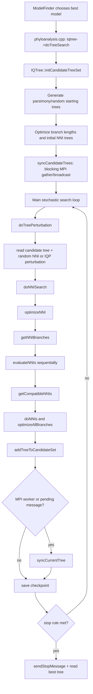

# Topology-Parallel Tree Search for IQ-TREE 3.1.2 - Code Audit, Baseline, and Roadmap

**Date:** 2026-05-24  
**Status:** Design and implementation roadmap. No code changes in this document.  
**Scope:** Post-ModelFinder IQ-TREE tree search on the current scratch source tree at `/scratch/rc29/as1708/iqtree3-mf-iso/src/iqtree3`, with emphasis on MPI/OpenMP behavior, current limitations, and a staged path toward topology-parallel CPU, GPU, and multi-GPU search.

**Key conclusion:** the proposed spatial/cellular search idea is applicable to IQ-TREE tree search only after reframing. The viable target is not a GPU shared-memory mesh holding full tree likelihood state. The viable target is a **hierarchical topology-island search**: MPI islands exchange candidate trees and split summaries; rank subcommunicators optionally cooperate on one topology with pattern-parallel likelihood; future GPU kernels score batches of topology moves over site patterns while compact topology descriptors stay near the SM.

---

## 1. Terminology correction: "SPR wall" is usually NNI search wall

Project logs and changelog tables often label the post-ModelFinder phase as **SPR wall** because IQ-TREE reports "tree search" after model selection. In the source, the production path is not usually the explicit `-spr` code path.

Default full run:

```text
phyloanalysis.cpp
  -> iqtree->doTreeSearch()
       -> stochastic perturbation
       -> doNNISearch()
       -> candidate-tree exchange over MPI
```

Explicit `-spr`:

```text
phyloanalysis.cpp
  -> iqtree->optimizeSPR()
       -> older recursive SPR implementation in phylotree.cpp
```

The existing `PhyloTree::optimizeSPR()` path is present, but it is not the normal production path used by the benchmark rows in `logs/runs/*.json` and `CHANGELOG.md`. The first implementation target should therefore be **topology-parallel stochastic NNI / island search**, not the literal legacy `optimizeSPR()` routine.

---

## 2. Measured baseline: current tree-search scaling

The tree-search phase already benefits from IQ-TREE's MPI island model. Each rank explores a local topology trajectory and exchanges candidate trees. The measured results below are from `CHANGELOG.md` and the JSON records in `logs/runs/`.

### 2.1 AA 100K and AA 1M

| Job | Build | Dataset | Nodes | Ranks x OMP | MF wall (s) | Tree-search wall (s) | Total wall (s) | lnL | Notes |
|---:|---|---|---:|---|---:|---:|---:|---:|---|
| 168425673 | vanilla CPU | AA 100K | 1 | 1 x 103 | 399.456 | 764.478 | 1,169.556 | -7,541,976.860 | Standard non-MPI baseline |
| 168584736 | FCA MPI | AA 100K | 2 | 2 x 103 | 149.029 | 383.876 | 537.750 | -7,541,976.853 | MPI tree-search speedup is already visible |
| 169095077 | FCA MPI | AA 100K | 1 | 1 x 103 | 258.773 | 738.569 | 1,000.811 | -7,541,976.861 | FCA source/binary, no MPI island benefit at np=1 |
| 168425491 | vanilla CPU | AA 1M | 1 | 1 x 103 | 7,587.459 | 15,098.605 | 22,776.226 | -78,605,196.573 | Baseline of record for AA 1M |
| 168635614 | FCA MPI | AA 1M | 2 | 2 x 103 | 3,076.873 | 7,868.928 | 10,945.801 | -78,605,196.443 | Correctness PASS |
| 168635615 | FCA MPI | AA 1M | 4 | 4 x 103 | 1,974.476 | 3,982.142 | 5,956.618 | -78,605,196.445 | Correctness PASS |
| 168586094 | FCA MPI | AA 1M | 8 | 8 x 103 | 1,443.892 | 2,147.499 | 3,671.618 | -78,605,196.497 | Correctness PASS |
| 168635616 | FCA MPI | AA 1M | 16 | 16 x 103 | 1,122.363 | 1,287.863 | 2,410.226 | -78,605,196.497 | Best current FCA MPI scaling row |
| 169096801 | FCA-WS A.2 | AA 1M | 16 | 16 x 103 | 1,139.494 | 1,198.689 | 2,419.671 | -78,605,196.497 | Warm-start broadcast fired; MF regressed, tree wall slightly lower |
| 169112256 | ATMD b3c | AA 1M | 16 | 16 x 103 | 2,113.706 | 1,958.174 | 4,327 | LG+G4 | K_outer=1, nested/NUMA path regressed |

Tree-search speedup on AA 1M from vanilla 1 node to FCA np=16 is approximately:

$$
\frac{15098.605}{1287.863} \approx 11.7\times
$$

That is real and substantial. It also means the next tree-search contribution must beat an already strong island baseline. The low-risk path is to make the island algorithm more intentional; the high-risk/high-reward path is to reduce the per-topology likelihood cost with subcommunicators or GPUs.

### 2.2 DNA controls

| Job | Build | Dataset | Nodes | Ranks x OMP | MF wall (s) | Tree-search wall (s) | Total wall (s) | Notes |
|---:|---|---|---:|---|---:|---:|---:|---|
| 168425674 | vanilla CPU | DNA 100K | 1 | 1 x 103 | 61.740 | 226.447 | 289.121 | Baseline |
| 168584737 | FCA MPI | DNA 100K | 2 | 2 x 103 | 26.252 | 86.613 | 113.754 | Strong tree-search scaling |
| 168425675 | vanilla CPU | DNA 1M | 1 | 1 x 103 | 3,500.825 | 2,596.995 | 6,114.450 | Baseline |
| 168592214 | FCA MPI | DNA 1M | 8 | 8 x 103 | 1,274.686 | 349.904 | 1,640.846 | Tree-search speedup ~7.4x |

DNA confirms that current MPI tree search can scale strongly when each rank's independent trajectory remains productive.

### 2.3 Parallel efficiency and Amdahl analysis (AA 1M)

This section derives the serial fraction and Amdahl ceiling for each phase using the AA 1M FCA MPI scaling runs. The reference $T(1)$ is FCA np=1 (job 168913089) — the single-rank version of the MPI binary — which isolates pure MPI scaling from binary-improvement effects. Using FCA np=1 rather than the vanilla baseline avoids conflating binary-level code improvements (the FCA `filterRates` pruning) with MPI parallelism.

**Method:** from Amdahl's Law,

$$\frac{1}{S(p)} = f_s + \frac{1-f_s}{p} \implies f_s = \frac{1/S(p) - 1/p}{1 - 1/p}$$

$f_s$ is estimated independently at each measured $p$ and averaged. Stability of the estimate across $p$ values confirms the model fits the data.

#### ModelFinder phase ($T(1) = 5{,}119.929$ s)

| $p$ | $T(p)$ (s) | $S(p)$ | $E(p) = S(p)/p$ | $f_s$ estimate |
|---:|---:|---:|---:|---:|
| 1 | 5,119.929 | 1.000 | 100.0% | — |
| 2 | 3,076.873 | 1.664 | 83.2% | 0.202 |
| 4 | 1,974.476 | 2.593 | 64.8% | 0.181 |
| 8 | 1,443.892 | 3.547 | 44.3% | 0.179 |
| 16 | 1,122.363 | **4.562** | **28.5%** | 0.167 |
| | | **mean** | | **0.182** |

$$\hat{f}_s^{\text{MF}} = 0.182 \quad\Rightarrow\quad S_{\max}^{\text{MF}} = \frac{1}{0.182} \approx 5.5\times$$

At np=16 the achieved speedup is $4.56\times$ out of a ceiling of $5.5\times$. We are at **83% of the Amdahl ceiling for ModelFinder**. Adding more MPI ranks buys almost nothing. The only viable path forward is to reduce $\hat{f}_s^{\text{MF}}$ itself — which is the direct motivation for Mode P (splitting pattern work across ranks within a single model evaluation).

#### Tree-search phase ($T(1) = 15{,}060.551$ s)

| $p$ | $T(p)$ (s) | $S(p)$ | $E(p) = S(p)/p$ | $f_s$ estimate |
|---:|---:|---:|---:|---:|
| 1 | 15,060.551 | 1.000 | 100.0% | — |
| 2 | 7,868.928 | 1.914 | 95.7% | 0.045 |
| 4 | 3,982.142 | 3.782 | 94.5% | 0.019 |
| 8 | 2,147.499 | 7.012 | 87.6% | 0.020 |
| 16 | 1,287.863 | **11.694** | **73.1%** | 0.025 |
| | | **mean** | | **0.027** |

$$\hat{f}_s^{\text{tree}} = 0.027 \quad\Rightarrow\quad S_{\max}^{\text{tree}} = \frac{1}{0.027} \approx 37\times$$

At np=16 we are at $11.7\times$ out of a ceiling of $37\times$ — only **32% of the Amdahl ceiling**. There is enormous scaling headroom. Projected theoretical scaling:

| $p$ | $S(p)$ projected ($\hat{f}_s = 0.027$) | $E(p)$ projected |
|---:|---:|---:|
| 16 | 11.6× | 72.7% |
| 32 | 17.9× | 55.9% |
| 64 | 24.7× | 38.6% |
| 128 | 30.5× | 23.8% |
| $\infty$ | 37× | — |

The 73.1% efficiency at np=16 is not a sign that tree search is near saturation. It is consistent with **work-imbalance** as the dominant degradation: with `numInitTrees=100` and 16 ranks, each rank evaluates fewer than 7 starting trees; stop-rule timing drifts between ranks; and candidate diversity collapses because only 20 NNI trees are selected from a very small per-rank pool. Structured island migration (Phase T.1) and split-based perturbation bias (Phase T.2) address all three.

#### Total wall

| $p$ | $T(p)$ (s) | $S(p)$ | $E(p)$ |
|---:|---:|---:|---:|
| 1 | 20,180.480 | 1.000 | 100.0% |
| 2 | 10,945.801 | 1.844 | 92.2% |
| 4 | 5,956.618 | 3.387 | 84.7% |
| 8 | 3,671.618 | 5.496 | 68.7% |
| 16 | 2,410.226 | **8.373** | **52.3%** |

$$\hat{f}_s^{\text{total}} = 0.068 \quad\Rightarrow\quad S_{\max}^{\text{total}} = 14.7\times$$

The weighted prediction verifies the model:

$$\hat{f}_s^{\text{total}} \approx \underbrace{0.254}_{w_{\text{MF}}} \times 0.182 + \underbrace{0.746}_{w_{\text{tree}}} \times 0.027 = 0.046 + 0.020 = 0.066$$

This matches the empirical $0.068$ within noise. The two-phase Amdahl model is internally consistent.

#### Summary and direct implications for this roadmap

| Metric | ModelFinder | Tree Search | Total |
|---|---:|---:|---:|
| $\hat{f}_s$ (serial fraction) | **18.2%** | **2.7%** | 6.8% |
| $S_{\max}$ (Amdahl ceiling) | **5.5x** | **37x** | 14.7x |
| $S$ at np=16 (measured) | 4.56x | 11.7x | 8.37x |
| Ceiling fraction at np=16 | **83%** | 32% | 57% |
| $E$ at np=16 | 28.5% | **73.1%** | 52.3% |

Two consequences:

1. **Tree search is the correct next performance target.** MF is near its architectural ceiling. Tree search has $\sim 3\times$ headroom before the current island model reaches diminishing returns. Phases T.1 and T.2 push efficiency above the current 73% by reducing work imbalance. They do not require any change to the likelihood kernel.

2. **Mode P shifts the bottleneck.** If Mode P reduces $\hat{f}_s^{\text{MF}}$ from 18% to approximately 5%, the weighted total ceiling rises to:
$$S_{\max}^{\text{total}} \approx \frac{1}{0.254 \times 0.05 + 0.746 \times 0.027} \approx \frac{1}{0.033} \approx 30\times$$
At that point tree-search tuning becomes the primary lever for total wall reduction.

---

## 3. Current post-ModelFinder tree-search algorithm

### 3.1 Entry path

Primary source files:

| File | Role |
|---|---|
| `main/phyloanalysis.cpp` | Calls `iqtree->doTreeSearch()` after ModelFinder/model initialization and prints tree-search wall time. |
| `tree/iqtree.cpp` | Main stochastic tree-search loop, candidate-tree set, MPI synchronization, NNI optimization. |
| `tree/phylotree.cpp` | Low-level topology mutation, NNI scoring, branch-length optimization, legacy SPR code. |
| `tree/candidateset.cpp` | Candidate tree population, topology de-duplication, best-tree selection, stable split occurrence counts. |
| `utils/MPIHelper.cpp` | MPI initialization and checkpoint/string send, receive, broadcast helpers. |
| `utils/stoprule.cpp` | Termination rule, usually unsuccessful-iteration stopping. |
| `utils/tools.cpp` | Defaults and CLI options: `numInitTrees`, `numNNITrees`, `popSize`, `speednni`, `-spr`. |
| `tree/phylokernelnew.h` | OpenMP/SIMD likelihood kernels used by NNI and branch optimization. |

### 3.2 Default control flow



### 3.3 Candidate population defaults

The current defaults in `utils/tools.cpp` make the topology search explicitly population-based:

| Parameter | Default | Meaning |
|---|---:|---|
| `numInitTrees` | 100 | Number of initial parsimony/random trees generated before local search. |
| `numNNITrees` | 20 | Number of best initial trees selected for NNI search. |
| `maxCandidates` | 20 | CandidateSet capacity. |
| `popSize` | 5 | Number of top candidate trees used for stochastic perturbation parent selection. |
| `unsuccess_iteration` | 100 | Stop after 100 unsuccessful iterations by default. |
| `speednni` | true | Reduced hill-climbing NNI after early rounds. |
| `tree_spr` | false | Legacy explicit SPR disabled by default. |

These defaults already encode a memetic/island philosophy: generate diverse starts, hill-climb locally, keep a ranked candidate population, perturb top candidates, and continue until no improvement.

---

## 4. Current OpenMP and MPI behavior

### 4.1 OpenMP pragmas that matter

OpenMP is heavily used inside likelihood kernels and some initialization work, not around independent topology moves.

| Location | Behavior |
|---|---|
| `tree/iqtree.cpp::initCandidateTreeSet` | Uses `#pragma omp parallel` and `#pragma omp for schedule(dynamic)` to generate initial parsimony trees. |
| `tree/phylokernelnew.h` | Uses `#pragma omp parallel for schedule(static) num_threads(num_threads)` over pattern packets in likelihood and derivative kernels. |
| `tree/phylosupertreeunlinked.cpp::doTreeSearch` | Uses OpenMP over partitions for unlinked supertree searches. |
| `tree/iqtree.cpp::evaluateNNIs` | **No OpenMP move-level parallelism**. NNI candidates are evaluated sequentially against one mutable `IQTree` state. |

This division is important. IQ-TREE currently parallelizes the **site-pattern dimension** inside one topology evaluation, but it does not parallelize independent NNI move evaluations within one tree object.

### 4.2 MPI primitives and current topology exchange

`MPIHelper::init()` requests `MPI_THREAD_FUNNELED`. This is adequate for the current design because MPI calls are made from the main thread, not from arbitrary OpenMP worker threads.

Current MPI behavior:

| Function | MPI behavior | Use in tree search |
|---|---|---|
| `MPIHelper::gotMessage()` | `MPI_Iprobe(MPI_ANY_SOURCE, MPI_ANY_TAG, MPI_COMM_WORLD)` | Master can opportunistically detect worker messages during NNI evaluation. |
| `sendCheckpoint()` / `recvCheckpoint()` | Serialize `Checkpoint` to a string and send/receive via `MPI_Send` / `MPI_Recv`. | Workers send current tree + score; master sends candidate updates. |
| `broadcastCheckpoint()` | `MPI_Bcast` of serialized checkpoint buffer. | Blocking candidate-tree synchronization after initial tree set and after selected phases. |
| `IQTree::syncCandidateTrees()` | Gather best candidate sets to master, then broadcast best candidates back. | Blocking synchronization. |
| `IQTree::syncCurrentTree()` | Worker sends current tree and receives candidate-set update; master receives one tree and optionally replies with top candidates. | Asynchronous-ish island exchange during main loop. |
| `IQTree::sendStopMessage()` | Master receives worker states, sends stop string, then `MPI_Barrier`. | Termination. |

The current MPI design is therefore **coarse-grained island parallelism**: each rank owns a full tree object, follows its own stochastic trajectory, and exchanges serialized candidate trees.

It is not fine-grained cooperative topology search. It does not split one NNI/SPR candidate evaluation across ranks, and it does not jointly score a batch of moves with a shared communicator.

---

## 5. Why naive topology parallelism breaks in the current code

### 5.1 NNI scoring mutates one shared tree in place

The current NNI scoring path is:

```text
IQTree::optimizeNNI
  -> evaluateNNIs
       -> PhyloTree::getBestNNIForBran
            -> temporarily swap neighbor pointers
            -> reorient partial likelihoods
            -> clear partials around the move
            -> optimize branch lengths
            -> compute likelihood
            -> swap topology back
```

Key mutable state:

| State | Why it blocks naive parallelism |
|---|---|
| `Node::neighbors` / `PhyloNeighbor` pointers | Move evaluation temporarily rewires the topology. Two threads evaluating two moves on the same tree would race. |
| `current_it`, `current_it_back` | Branch optimization global scratch pointers for the active branch. |
| `nni_partial_lh`, `nni_scale_num` | Shared NNI scratch buffers allocated once per tree. |
| `central_partial_lh`, `central_scale_num` | Large per-tree partial-likelihood store; invalidated by topology changes. |
| `theta_all`, `theta_computed`, `buffer_partial_lh`, `buffer_scale_all` | Branch-length optimization caches and scratch space. |
| `curScore` and branch lengths | Move scoring changes lengths and restores them. |

Therefore this is unsafe:

```cpp
#pragma omp parallel for
for (branch in nniBranches)
    getBestNNIForBran(branch);  // unsafe today
```

Parallel move evaluation requires a refactor into either independent tree copies, thread-local scratch contexts, or a stateless/copy-on-write move evaluator.

### 5.2 Full tree copies are simple but memory-expensive

For AA 1M, the ModelFinder B.5 memory work estimated one full tree partial-likelihood working set around **64 GB** for the heavy cases. Even if tree search uses only LG+G4 rather than all candidate models, the partial-likelihood state remains far larger than L3/shared memory and expensive to duplicate many times per node.

Full tree copies are fine for MPI rank islands across nodes. They are not a good way to obtain dozens of move-parallel workers inside one rank.

### 5.3 `-spr` is not the production substrate

`PhyloTree::optimizeSPR()` and helpers `optimizeSPR_old`, `swapSPR`, and `assessSPRMove` recursively prune/regraft, allocate fresh partial-likelihood buffers, print debug lines, and are only selected by the CLI `-spr`. They are useful as a reference for candidate generation, but not a clean base for a production topology-parallel port.

The better first target is current stochastic NNI search. A modern SPR layer can be added later as a batched candidate generator and scorer.

### 5.4 `MPI_COMM_WORLD` collectives cannot be inserted into independent tree search

The Mode P lesson applies sharply here. During tree search, ranks are intentionally evaluating different topologies and different branch/move sequences. If a kernel-level `MPI_Allreduce` over `MPI_COMM_WORLD` is called inside this independent search, ranks will enter collectives in different orders and deadlock.

The safe tree-search version of Mode P requires **subcommunicators**:

```text
MPI_COMM_WORLD ranks 0..15

island group 0: ranks 0..3    one topology trajectory, collective order shared
island group 1: ranks 4..7    one topology trajectory, collective order shared
island group 2: ranks 8..11   one topology trajectory, collective order shared
island group 3: ranks 12..15  one topology trajectory, collective order shared
```

Within a group, pattern-parallel likelihood is safe because every rank follows the same move sequence. Between groups, leaders exchange candidate trees/splits asynchronously or at migration intervals.

---

## 6. Reframed architecture: Topology-Parallel Tree Search (TPTS)

### 6.1 Correct abstraction

The architecture should be described as:

> A hierarchical island-model tree search where compact topology descriptors and split summaries migrate between independent local-search islands, while expensive likelihood evaluations are accelerated by pattern-parallel CPU/GPU kernels.

Not:

> A GPU shared-memory grid where each cell owns a complete tree and full partial-likelihood state.

The latter is physically impossible at AA 1M scale: topology descriptors fit in GPU shared memory; full likelihood state does not.

### 6.2 Proposed hierarchy

```text
Level 0: Current baseline
    MPI rank = one full IQTree island
    OMP threads = pattern-parallel likelihood inside that tree

Level 1: Structured CPU topology islands
    MPI rank = one island, but migration is explicit and scheduled
    Exchange: candidate Newicks + scores + split-frequency summaries

Level 2: Rank-group islands
    MPI subcommunicator = one island
    Ranks inside group cooperate on pattern slices for one topology
    Group leaders exchange topology/split summaries

Level 3: CPU batched move scorer
    One island can score many NNI/SPR move descriptors in parallel
    Requires stateless or thread-local move evaluation context

Level 4: GPU batched likelihood/move scoring
    Alignment/model/partials live in GPU global memory
    Topology/move descriptors are compact and batched
    CPU still owns canonical topology mutation at first

Level 5: Multi-GPU island mesh
    NCCL/NVLink within an island group for pattern reductions
    MPI between island leaders for migration and stop control
```

### 6.3 What migrates between islands

Existing `CandidateSet` already has most of the required semantics:

| Object | Current representation | Use in TPTS |
|---|---|---|
| Full candidate tree | Newick string + score in `CandidateSet` | Migration payload and checkpoint compatibility. |
| Topology identity | Canonical topology string from `CandidateSet::convertTreeString` | Duplicate suppression. |
| Stable split summary | `CandidateSet::computeSplitOccurences` and `candSplits` | Memetic crossover genes; stable-clade migration; perturbation bias. |
| Parent selection | `getRandTopTree(popSize)` / `getNextCandTree()` | Island parent selection. |
| Search stopping | `StopRule` | Needs leader-level/global aggregation for rank-group islands. |

The novel work is not inventing topology storage from scratch. It is making the migration and recombination policy explicit, measurable, and scalable.

---

## 7. Implementation phases

### Phase T.0 - Tree-search instrumentation and baseline lock

**Goal:** make current tree-search behavior measurable before changing it.

Changes:

- Add `TS-MPI-DIAG` lines gated by a new CLI flag, for example `--ts-diag`.
- Record per rank:
  - number of main-loop iterations;
  - number of NNI searches;
  - NNI branches evaluated per iteration;
  - positive NNIs found;
  - compatible NNIs applied;
  - number of candidate trees sent/received;
  - time spent in `doTreePerturbation`, `doNNISearch`, `optimizeAllBranches`, `syncCurrentTree`;
  - stop-rule state and last improved iteration.
- Extend log parser to capture `Total number of trees received`, `Total number of trees sent`, `Total number of NNI searches done by myself`, and `Wall-clock time used for tree search`.

Files:

- `tree/iqtree.cpp`
- `tree/iqtree.h`
- `utils/tools.{cpp,h}`
- `tools/` or `research/Treesearch/tools/` parser scripts

Validation:

- AA 100K np=1/2 and AA 1M np=4/8/16.
- lnL unchanged within existing tolerance.
- Tree-search wall overhead from diagnostics < 1%.

Exit criterion:

- A table equivalent to the ModeFinder `MF-TIME` summary, but for tree search.

### Phase T.1 - Structured MPI island exchange

**Goal:** replace opportunistic master/worker candidate exchange with explicit migration intervals while preserving one-rank-one-tree semantics.

Current behavior:

- Workers send current tree to master during `syncCurrentTree()`.
- Master may reply with top candidates when candidate set changed.
- Blocking gather/broadcast happens in `syncCandidateTrees()` around initialization.

New behavior:

- Add migration interval `--ts-migrate-every N` iterations.
- At migration points, every rank sends a compact candidate summary.
- Start with master-mediated gather/broadcast for minimum risk.
- Later allow ring or allgather topology migration.

Payload:

```text
tree_newick
score
iteration
source_rank
optional split hash summary
```

Validation:

- Same final lnL or better than current FCA MPI.
- No regression > 3% in AA 1M np=16 tree-search wall.
- Candidate diversity increases or stays flat: more distinct topologies in candidate set.

Expected value:

- Low-risk improvement in robustness and research visibility.
- Wall-time gain may be modest because current MPI island scaling is already strong.

### Phase T.2 - Split-based memetic migration

**Goal:** turn the candidate-set split summaries into an actual crossover/migration mechanism.

Current useful code:

- `CandidateSet::computeSplitOccurences()` builds split frequencies across candidate trees.
- `IQTree::perturbStableSplits()` and `getStableBranches()` already use stable splits to guide perturbation.

Design:

1. Each island exports top-k stable or high-gain splits.
2. Receiving island merges compatible high-confidence splits into its perturbation policy.
3. Generate a child topology by:
   - selecting a parent from local `CandidateSet`;
   - protecting imported compatible splits;
   - applying random NNI/IQP perturbations outside protected regions;
   - running `doNNISearch()` for exact local refinement.

Do not attempt arbitrary tree crossover first. Use split-guided perturbation because it composes with existing IQ-TREE logic and constraints.

Validation:

- Compare best lnL distribution over repeated seeds, not just one seed.
- Track whether imported splits survive final local search.
- Check wall-time overhead of split serialization and compatibility filtering.

Expected value:

- Higher chance of escaping local topology traps.
- Possible wall-time reduction if fewer unsuccessful iterations are needed.
- Scientific novelty is strong: it makes IQ-TREE's implicit candidate-split mechanism into an explicit memetic island algorithm.

### Phase T.3 - Rank-group islands with pattern-parallel likelihood

**Goal:** combine topology islands with Mode P-style pattern parallelism safely.

Design:

- Split `MPI_COMM_WORLD` into fixed island communicators with `MPI_Comm_split`.
- Every rank in an island group holds the same current topology and follows identical NNI/branch optimization order.
- Kernel Allreduces use the island communicator, never `MPI_COMM_WORLD`.
- Only group leaders participate in inter-island migration.

Example:

```text
16 ranks:
    16 groups x 1 rank  = current MPI island baseline
     8 groups x 2 ranks = moderate pattern-parallel speed per topology
     4 groups x 4 ranks = fewer islands, faster exact scoring per island
     2 groups x 8 ranks = high pattern-parallel speed, less diversity
     1 group  x 16 ranks = Mode P-like single trajectory, maximum scoring speed, least diversity
```

This phase is blocked on a correct Mode P kernel implementation and should reuse the Mode P ISO discipline.

Validation:

- Build a matrix of group sizes on AA 100K and AA 1M.
- Measure wall time, final lnL, number of distinct topologies, and NNI searches per group.
- Pass if at least one grouping beats current np=16 tree-search wall or reaches better lnL at equal wall.

Main risk:

- Collective ordering. Every rank in a group must call likelihood kernels in the same sequence.

Mitigation:

- Group-level tree object is deterministic.
- Only group leaders exchange topology updates at migration barriers.
- No asynchronous topology replacement inside a group while a collective likelihood step is active.

### Phase T.4 - CPU batched NNI move scorer

**Goal:** parallelize move scoring within one island without duplicating full `IQTree` objects.

Required refactor:

Current:

```text
evaluateNNIs -> getBestNNIForBran mutates tree, scores one branch, restores tree
```

Target:

```text
generate move descriptors
prepare read-only base traversal/partials
score move descriptors with per-worker scratch context
reduce positive moves
apply compatible moves to canonical tree
```

Move descriptor should contain:

- central branch IDs;
- neighbor IDs for the two NNI alternatives;
- branch lengths around the move;
- pointers or indices to required partial-likelihood buffers;
- constraint/stable-split flags;
- optional approximate upper-bound score.

Scratch context should contain:

- temporary partial likelihood buffers;
- scale buffers;
- temporary branch lengths;
- derivative buffers;
- no shared writes to `Node::neighbors`.

Implementation strategy:

1. Add a serial stateless evaluator that returns exactly the same result as `getBestNNIForBran()` for one branch.
2. Run it side-by-side with the existing evaluator under `--ts-verify-move-eval`.
3. Only after parity, add OpenMP over move descriptors.

Validation:

- AA 100K np=1 with serial stateless scorer: identical move choices and final lnL.
- OpenMP move scorer: same final lnL within tolerance; no thread sanitizer-visible races in debug builds.
- Measure speedup by NNI branches evaluated per second.

Expected value:

- Medium. The likelihood kernel already uses 103 threads, so move-level parallelism competes with site-level parallelism unless nested threading is carefully controlled.
- Best use may be sub-full-thread configurations or batched GPU scoring.

### Phase T.5 - Modern SPR candidate generator and screener

**Goal:** add real topology-neighborhood breadth without relying on the legacy `-spr` path as production code.

Design:

- Generate SPR candidates as compact prune/regraft descriptors.
- Use cheap filters first:
  - constraint compatibility;
  - stable-split protection;
  - path radius;
  - approximate likelihood or parsimony delta;
  - upper-bound screening if available.
- Exact-optimize only top candidates with the existing branch-length optimization.

Files likely involved:

- `tree/phylotree.cpp` for existing SPR references;
- new `tree/topologymove.{h,cpp}` or local additions to `iqtree.cpp`;
- `tree/split.*` for split compatibility helpers;
- `tree/candidateset.*` for migration/crossover integration.

Validation:

- Start with small AA/DNA 100K runs.
- Verify exact likelihood after applying selected SPR candidates.
- Compare final lnL over multiple seeds against default stochastic NNI.

Expected value:

- High for search quality on rugged topologies.
- Wall-time value depends on the quality of screening. Exhaustive exact SPR is too expensive.

### Phase T.6 - Single-GPU resident likelihood and batched move scoring

**Goal:** move the expensive scoring part of a topology island to GPU without pretending full trees fit in shared memory.

Correct GPU memory model:

| Data | Location |
|---|---|
| Alignment patterns, tip states, model matrices | GPU global / read-only cache |
| Partial likelihood arrays | GPU global memory, possibly compressed/streamed |
| Topology/move descriptors | Constant/shared memory or registers |
| Per-move scratch | Shared memory only for small descriptors and reductions, not full partials |
| Likelihood reductions | Warp/block reductions, then device/global reduction |

First GPU target:

- Batch score NNI alternatives for one canonical topology.
- CPU still decides compatible moves and applies topology changes.
- GPU returns candidate scores and optional optimized local branch lengths.

Do not start with:

- multiple full tree states per SM;
- arbitrary full SPR exact optimization;
- NCCL before single-GPU kernel correctness is proven.

Validation:

- GPU score for a batch of NNI moves matches CPU `getBestNNIForBran()` within numerical tolerance.
- End-to-end final lnL matches CPU search on AA 100K.
- Measure PCIe/NVLink transfer volume; require alignment/model/partials to stay resident across many batches.

### Phase T.7 - Multi-GPU topology-island mesh

**Goal:** combine rank-group islands, GPU resident scoring, and topology migration.

Architecture:

```text
node/GPU group = one or more topology islands
inside island  = GPU pattern-parallel likelihood, NCCL reductions if multi-GPU
between islands = MPI migration of Newick + score + split summaries
```

MPI/NCCL boundary:

- NCCL or GPU-aware MPI only inside an island communicator.
- MPI between island leaders for topology migration.
- Never use global collectives inside independent tree trajectories.

Validation:

- Single GPU parity.
- One node multi-GPU parity.
- Multi-node, multi-GPU island scaling.
- Compare three metrics:
  - wall-clock time;
  - final lnL distribution over seeds;
  - number of distinct high-quality topologies discovered.

---

## 8. Expected efficacy

| Approach | Feasibility | Expected wall-time value | Expected search-quality value | Risk | Verdict |
|---|---:|---:|---:|---:|---|
| Current MPI island baseline | Already implemented | High, already ~11.7x tree-search speedup at AA 1M np=16 | Medium | Low | Baseline to beat |
| Structured MPI migration | High | Low-medium | Medium | Low | First implementation step |
| Split-based memetic migration | Medium-high | Medium if fewer iterations needed | High | Medium | Strong thesis contribution |
| Rank-group Mode P tree search | Medium | Medium-high if group size is tuned | Medium | High | Requires Mode P correctness first |
| CPU batched move scoring | Medium | Medium, constrained by existing site-level OMP | Medium | High | Useful bridge to GPU |
| Legacy `-spr` parallelization | Low-medium | Unclear | Unclear | High | Do not use as first production target |
| GPU batched NNI/SPR scoring | Medium | High long-term | High | High | Correct future GPU target |
| Full tree mesh in GPU shared memory | Low | Low/impossible at AA 1M | Low | Very high | Reject as stated |

The measured Amdahl analysis (§2.3) provides the quantitative grounding for these verdicts. Tree search at np=16 is at only 32% of its Amdahl ceiling ($S_{\max} \approx 37\times$, $\hat{f}_s = 2.7\%$), with efficiency 73.1%. ModelFinder at np=16 is at 83% of its Amdahl ceiling ($S_{\max} \approx 5.5\times$, $\hat{f}_s = 18.2\%$). Adding more MPI ranks to the current design provides no further MF gain.

The strongest near-term claim is not "we will instantly beat np=16 tree search by 10x". The honest claim is:

1. IQ-TREE already has a topology-island substrate operating at 73% parallel efficiency at np=16.
2. That substrate can be made explicit, measurable, and memetic with relatively low risk — directly attacking the work-imbalance cause of the 27% efficiency loss.
3. Larger gains require either safe rank-group pattern parallelism (Phase T.3) or GPU-resident batched move scoring (Phase T.6).
4. The full shared-memory mesh concept must be narrowed to topology/move descriptors, not full likelihood state.
5. Once Mode P lands for MF, tree-search tuning becomes the dominant lever for total wall reduction.

---

## 9. Validation matrix

### 9.1 Correctness gates

| Gate | Dataset | Config | Pass criterion |
|---|---|---|---|
| TS-C1 | AA 100K | np=1 | Final lnL within 0.5 of baseline; best model LG+G4. |
| TS-C2 | AA 100K | np=2 | Final lnL within 0.5; no MPI deadlock; tree messages sane. |
| TS-C3 | AA 1M | np=4 | Final lnL within 1.0 of baseline; no tree-search wall regression > 5%. |
| TS-C4 | AA 1M | np=16 | Final lnL within 1.0; compare to 1,287.863 s tree-search wall. |
| TS-C5 | DNA 1M | np=8 | Final lnL within 1.0; compare to 349.904 s tree-search wall. |

### 9.2 Search-quality gates

Run multiple seeds, not just seed 1:

| Metric | Why |
|---|---|
| Best lnL distribution | Memetic migration may improve quality even if one seed ties. |
| Number of distinct high-scoring topologies | Measures exploration, not just exploitation. |
| Iteration of last improvement | Tests whether migration reduces unsuccessful iterations. |
| Split survival rate | Tests whether imported splits are useful or noise. |
| Candidate-set entropy | Detects premature convergence across islands. |

### 9.3 Performance gates

| Phase | Primary performance target |
|---|---|
| T.0 | Diagnostics overhead < 1%. |
| T.1 | No regression > 3%; better candidate diversity. |
| T.2 | Equal or better lnL distribution at equal wall; fewer unsuccessful iterations. |
| T.3 | One rank-group configuration beats current np=16 tree-search wall or improves lnL at equal wall. |
| T.4 | Move evaluations per second improves under controlled thread allocation. |
| T.6 | GPU NNI batch scorer beats CPU scorer for sufficiently large batches without transfer bottleneck. |
| T.7 | Multi-GPU scaling improves wall or quality over CPU rank-group islands. |

---

## 10. Immediate next steps

1. Implement Phase T.0 diagnostics only.
2. Re-run AA 100K np=1/2 and AA 1M np=4/16 with `--ts-diag`.
3. Add parser output under `logs/runs/*tree_search*` or a `tree_search_summary` JSON block.
4. Use diagnostics to choose the first algorithmic lever:
   - if tree message exchange is sparse and candidate diversity collapses, do T.1/T.2;
   - if NNI scoring dominates and branches per second are low, start T.4;
   - if per-topology likelihood dominates and Mode P is ready, start T.3.
5. Defer GPU work until CPU move descriptors and resident-data assumptions are proven.

---

## 11. Design rules carried forward from ModelFinder work

- Empirical logs override theoretical elegance.
- Do not add global collectives inside independent rank trajectories.
- Never duplicate full tree likelihood state casually; memory dominates.
- Keep the first implementation read-only/diagnostic if the current behavior is not fully measured.
- Validate with final lnL, best model, wall time, and per-rank diagnostics.
- Treat negative results as publishable when they explain the hardware/biology mismatch.

The tree-search opportunity is real, but the honest architecture is an island/memetic/pattern-parallel hierarchy, not a literal full-state GPU mesh.